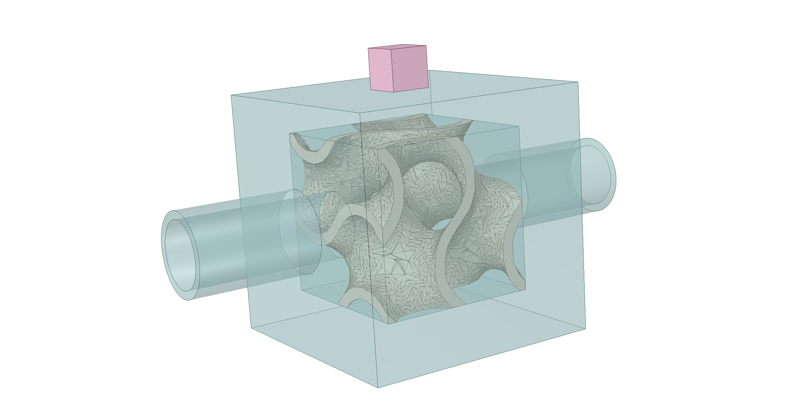
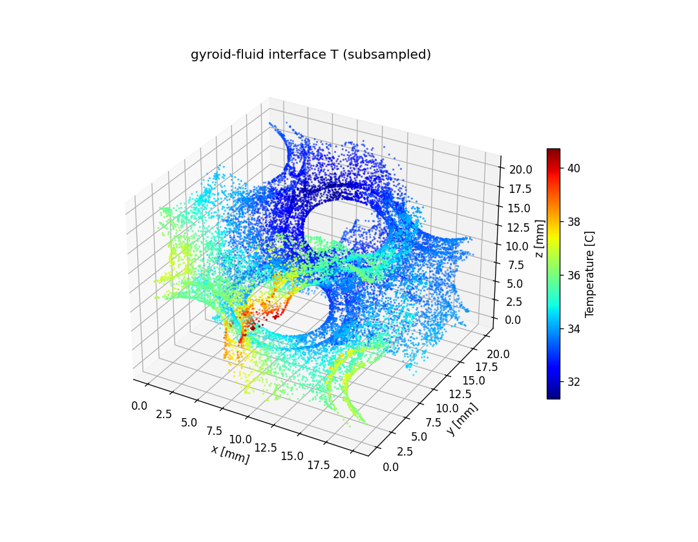
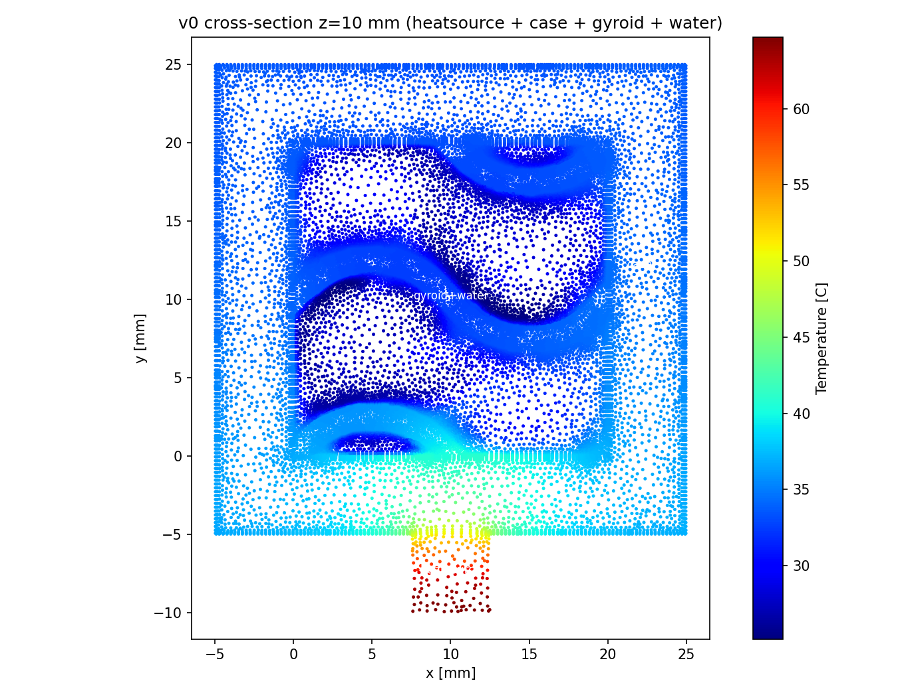

# Gyroid TPMS 散热器 CFD 流水线（Fluent FT 容错网格）

单晶胞（20³ mm）Gyroid 三周期极小曲面（TPMS）散热结构的**端到端 CFD 流水线**：
隐式场设计 → 解析 CAD STEP 缝合 → 夹具装配 → Fluent 容错网格（wrap）→ 解算 → 结果汇总。

```
流水线: design_gyroid → rebuild_fixture → mesh_ft → solve_ft → report_results
```

---

## 1. 结构预览

**Gyroid 单元结构**（20³ mm 单晶胞，隐式场 `|φ| ≤ C` 等值面；固体 = 极小曲面薄壳）：



**CFD 温度云图**（3D 视图 + z=10mm 热源区截面，含 gyroid / 夹具 / 水 / 热源全区域）：





## 2. 目录结构

```
gyroid-heatsink-pipeline/
├── README.md                          ← 本文件（总流程）
├── images/                            ← 结构预览图（gyroid 单元 + CFD 温度云图）
├── docs/
│   └── Fluent_FT_Audit_20260810.md    ← 完整审计文档（所有决策、事故链、铁则来源）
├── scripts/
│   └── build_all_variant_fixtures.py  ← 夹具几何库（6 板 + 2 管 + 热源; 唯一跨目录依赖）
└── src/tpms/pipeline/
    ├── design_gyroid.py          (1) 隐式场设计 → 缝合 STEP
    ├── rebuild_fixture.py        (2) 夹具装配 → 含 inlet/outlet 盘面的 STEP
    ├── mesh_ft.py                (3) Fluent FT 容错网格（4 区域 wrap）
    ├── solve_ft.py               (4) 稳态共轭传热解算 + 质量守恒 gate
    └── report_results.py         (5) 多候选结果对比汇总
```

## 3. 环境要求

| 组件 | 版本/配置 |
|------|-----------|
| Python | `C:/anaconda3/envs/magnet2/python.exe` |
| Ansys Fluent | 26.1（Fault-tolerant meshing + solver） |
| PyFluent | 0.38.1（`ansys.fluent.core`） |
| OCP | 7.8（Open CASCADE Python，缝合/布尔/STEP 读写） |
| trimesh | 任意近期版本（marching cubes 等值面） |
| numpy / scipy | 标准 |
| 硬件 | 48 逻辑核（2 并发链已验证安全） |

## 4. 硬性规则（不可违反）

这些规则由多次失败实验沉淀而来（详见审计文档），违反会直接失败：

1. **gyroid 必须是解析 CAD SOLID STEP**（MANIFOLD_SOLID_BREP=1, PLANE faces）。
   STL / 网格化 STEP 会让 Fluent wrap 泄漏（`leakage fluid-water to solid-gyroid`）。
   → 禁止 `--stl` 捷径。全部链必须走 `design_gyroid.to_solid_step()` 的
   OCC 缝合（`BRepBuilderAPI_Sewing(tol=0.3)`，缝合前丢弃 pad 碎片）。
2. **壁厚 > 1mm**（`design_gyroid` 内置 gate，理论壁厚不达标 → exit 2 拒绝）。
3. **贴地 z_min=0**（NO-GAP 规则）：gyroid 必须贴 case 底面，无悬浮、无缝隙
   （`rebuild_fixture` 检查，偏差 >0.05mm → 拒绝）。
4. **分辨率 res=0.6**（26k 面 / 62MB STEP，缝合 29s；res 0.3 = 97k 面不可接受）。
5. **单文件导入**：mesh_ft 不拆 STL，4 区域（fluid-water / solid-fixture /
   solid-gyroid / solid-heatsource）全部 wrap。
6. **水密（watertight）**：marching cubes 等值面必须水密（强 hybrid/Fourier
   组合可能撕裂拓扑 → 负体积 → wrap 泄漏），`design_gyroid` 内置 gate
   （非水密 → 30s 内 exit 2 拒绝，不浪费 mesh 时间）。

## 5. 流水线逐步说明

所有命令在仓库根目录运行，`PY=C:/anaconda3/envs/magnet2/python.exe`。

### 第 1 步：design_gyroid.py —— 隐式场设计

```
$PY src/tpms/pipeline/design_gyroid.py --cid v6 --res 0.6
```

- 隐式场：`phi = g(gyroid) [+ hybrid 混合] [+ Fourier 谱扰动]`
  - gyroid 场：`g = sinX·cosY + sinY·cosZ + sinZ·cosX`
  - diamond 场（hybrid 时）：`d = sinX·sinY·sinZ + sinX·cosY·cosZ + cosX·sinY·cosZ + cosX·cosY·sinZ`
  - **hybrid 语义（易错）**：`--hybrid H` 时 `phi = H·g + (1−H)·d`，即 **H=1 纯 gyroid、H=0 纯 diamond**
  - Fourier 扰动（方向可选）：
    - `--fourier "k,amp,phase"` → x 向（兼容 v4 复现）
    - `--fourier "z,1,0.6,-1.5708"` → **z 向**（流动方向）；`z,2,0.6,0.0;z,3,0.5,1.0` 多条用 `;` 分隔
    - `--fourier-amp 0.25` 总振幅标度；`phase=−π/2` → 调制峰对准热源区（z≈10）
  - 各向异性：`--cell-x/y/z`（周期缩放）
- 固体 = `|phi| ≤ C`（C 由 porosity 决定，P80 → C≈0.31）
- 输出：`{cid}_solid.step`（缝合 SOLID）+ `{cid}_design_meta.json`（含壁厚 gate 结果）
- 耗时 ≈ 33~43s

### 第 2 步：rebuild_fixture.py —— 夹具装配

```
$PY src/tpms/pipeline/rebuild_fixture.py v6
```

- 读 `{cid}_solid.step`，装入 20³ 夹具：6 块板（底/顶/前/后/左/右，5mm）+ 2 根水管
  （OD10/ID8，inlet z=−20 / outlet z=+40）+ 5³ 热源（贴底居中，z∈[7.5,12.5]）
- 布尔操作：夹具与晶胞区求差（水管凸台切除）+ 热源独立
- 检查：NO-GAP（z_min=0）、单一 solid
- 输出：`{cid}_nowater_disks.step`（3 solids + 2 盘面；inlet/outlet 盘面 Ø8 @ z=−20/+40）
- 耗时 ≈ 74s

### 第 3 步：mesh_ft.py —— Fluent FT 容错网格

```
$PY src/tpms/pipeline/mesh_ft.py v6
```

- 启动 Fluent meshing（4 核），Discovery FMD 导入 `{cid}_nowater_disks.step`
- 4 区域全 wrap：fluid-water(fluid) / solid-fixture(solid) / solid-gyroid(solid,
  材料点 9.95,9.95,9.95) / solid-heatsource(solid)；leakage=1mm（≥3.5mm 孔道必须
  保持开放，防 auto-leakage 封死孔道）
- 体积填充 poly-hexcore；写 `{cid}_sep.cas.h5`（检查点，可续跑）→
  `{cid}_ft_inlet_outlet.cas.h5`（入口/出口 zone 分离，~185k 网格）
- 耗时 ≈ 5 min

### 第 4 步：solve_ft.py —— 解算

```
$PY src/tpms/pipeline/solve_ft.py v6
```

- 启动 Fluent solver（16 核），读 `{cid}_ft_inlet_outlet.cas.h5`
- 边界条件：入口 0.0332 m/s @ 298.15K；出口 0 Pa
- 热源：30W / 125e-9 m³ = 2.4e8 W/m³；hybrid 初始化（TUI）+ 150+200 迭代
- 传热 interface：`mesh_interfaces.create(si_name="intf", all_bnd=True)`
- 输出：`{cid}_solve_result.json`（Tmax、dP、质量守恒 gate、q_water 守恒）
  + `{cid}_ft_solved.cas/dat.h5`
- 耗时 ≈ 2 min

### 第 5 步：report_results.py —— 汇总

```
$PY src/tpms/pipeline/report_results.py
```

- 扫描 `output/sims/fluent_ft_variants/*/` 下所有 `*_solve_result.json`
- 输出 `comparison.json` + `comparison.md`（Tmax、dP、q_frac 对比表）

## 6. 复现配置（REPRO）

`design_gyroid.py` 内置 `--cid` 复现表：

| cid | 配置 | 说明 |
|-----|------|------|
| v0 | porosity 0.80 | 基线 |
| v1 | porosity 0.50 | 致密结构（Tmax 最低，dP 高） |
| v2 | porosity 0.90 | 壁厚 gate 拒绝（反面教材） |
| v3 | cell_x 30 | 各向异性 1.5× |
| v4 | fourier "2,0.6,0.0;3,0.5,1.0" amp 0.25 | x 向谱扰动 |
| v5 | hybrid 0.5 | gyroid+diamond 混合 |
| v6 | 纯 gyroid res 0.6 | 本流水线基准 |

## 7. 故障排查速查

| 现象 | 原因 | 对策 |
|------|------|------|
| wrap 泄漏 `leakage fluid-water to solid-gyroid` | gyroid 是 STL/网格化 STEP，或 marching cubes 非水密（拓扑破坏） | 重跑 design 缝合链（无 --stl）；非水密会被 design gate 30s 内拒绝 |
| wrap `placed too close to the geometry` | 几何在 wrap 边界内太密（如相位 +π/2 入口加密） | 该设计不可行，换参数重试 |
| 壁厚 gate 拒绝 | porosity 太高/扰动过强 | 调低 porosity 或 fourier_amp |
| solve 挂起无输出 | 解算卡死 | 2400s 超时自动杀（每步都有） |
| 1e9 温度/大质量不平衡 | 多实例并发过载 | 控制并发实例数（≤2 条链） |
| 水停在 z≈0 或 outlet 盘被吸收 | 孔道被 wrap 当泄漏封死 | 保持 leakage=1mm 固定 |

## 8. 快速上手（示例：跑 v6 全链）

```bash
cd <本仓库根目录>
PY=C:/anaconda3/envs/magnet2/python.exe

# 1) 设计
$PY src/tpms/pipeline/design_gyroid.py --cid v6 --res 0.6
# 2) 夹具
$PY src/tpms/pipeline/rebuild_fixture.py v6
# 3) 网格
$PY src/tpms/pipeline/mesh_ft.py v6
# 4) 解算
$PY src/tpms/pipeline/solve_ft.py v6
# 5) 汇总
$PY src/tpms/pipeline/report_results.py
```

（输出目录：`output/tpms/unit_cell_variants/`（STEP）、`output/sims/fluent_ft_variants/`（网格+解算）。）
