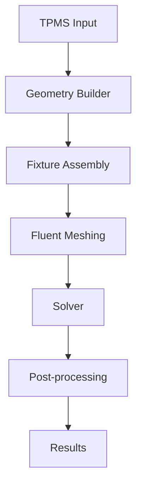

# Fluent FT 双目录架构审计报告（2026-08-10）

> 审计范围：`src/fluent_ft_v0/`（FT v0 基准 + v4/v5 变体）与 `src/tpms/fluent solver/`（共形路线遗留 + FT 变体源头）
> 方法：READ / TRACE / COMPARE / DOCUMENT，未修改任何代码
> 证据优先级：2026-08-10 实际源码 → 未提交 diff → 最新 Fluent logs/results → git history → 早期代码 → 早期 Markdown

---

## 1. A — `src/fluent_ft_v0/` 的职责

**Fault-tolerant (FT) meshing 路线的 v0 基准工作流全链**（几何构建 → FT 网格 → 分区/BC → 求解 → 后处理 → 结果），另含 v4/v5 变体仿真归档。

| 子目录 | 内容 | 数量 |
|---|---|---|
| `code/` | 核心工作流 11 + 几何构建 15 + 诊断探针 36 | 62 个 .py |
| `results/` | v0 成功结果（solve_result2.json、contour PNG×3）+ 输入网格 v0_ft_inlet_outlet.cas.h5 | 15 |
| `variants/` | v4/v5 变体 pipeline/求解脚本 + 结果对比（**落后归档副本**） | ~15 |
| `docs/` | 端到端避坑指南 | 1 |

**关键判定**：
- 成功求解脚本 = `code/fluent_v0_ft_solve2.py`（`mesh_interfaces.create(si_name="intf", all_bnd=True)` 修复，L109）
- 失败对照 = `code/fluent_v0_ft_solve.py`（手动 Coupled → 5000K 事故）
- 网格链 = `code/ft_final_inout3.py` → `code/ft_apply_bc2.py` → `code/ft_apply_bc3.py`（产出 `v0_ft_inlet_outlet.cas.h5`，185,819 cells）
- 无模块化：62 个脚本全部独立运行，靠中间产物（cas.h5/json）衔接，仅 `build_*.py` 经 `sys.path` 引用仓库根 `scripts/build_all_variant_fixtures.py`

## 2. B — `src/tpms/fluent solver/` 的职责

**"v0 共形路线 + FT 路线过渡期"的杂货目录**（15 个 .py）：

| 状态 | 文件 | 说明 |
|---|---|---|
| **在用（live 源头）** | `ft_pipeline_variant.py`、`fluent_ft_solve_variant.py` | v1–v5 FT 变体的**正式入口与唯一当前版本**（v3 配置、size_mm 尺寸场、OBJ.lower()、leak_mm、resume re-sep 都在这里） |
| 历史基线（共形路线） | `fluent_v0_solve.py`、`fluent_v0_docflow.py`、`fluent_v0_inspect.py` | v0 **conformal** meshing + solve（与 FT 路线平行，已被取代；scripts/ 与 fluent_meshing/ 有 md5 相同三副本） |
| 废弃原型 | `fault_tolerant_v1.py` | v1 FT 早期尝试，运行 FAIL（`output/sims/ft_v1/ft_result.json`），思路被 ft_pipeline_variant.py 继承 |
| 死代码 | `post_contour.py`、`post_cross_section.py`、`press_check.py`（dP=4.49 写死 L21） | 只针对共形结果 `_fluent_v0_solve/`，FT 后继 = `code/ft_contour_plots.py` |
| 废弃探针 | `_probe2/3.py`、`_probe_post.py`、`probe_sep2.py` | 0.38.1 API 探测 |
| 历史 | `scdocx_auto.py` | STEP→scdocx + Named Selection（整条 scdocx/共形路线已退役） |
| 文档 | `README_操作记录.md` | 共形路线权威操作记录（313 行，仍具文档价值） |

## 3. C — 两者关系（Case B + C + E 混合，非 A/D）

- **非 Case A**（旧 V0 prototype vs 新 general impl）：恰好**相反**——general 参数化版本在 `tpms/fluent solver/`（源头），`fluent_ft_v0/variants/` 是**落后归档副本**
- **Case B 部分成立**：v0 共形三件套（`tpms/fluent solver/fluent_v0_solve.py` 等）vs FT 全链（`fluent_ft_v0/code/`）——两条平行 meshing 路线
- **Case C 成立（重复）**：① solve/solve2/variant 三份求解脚本 ~90% 相同；② variants/ 归档落后源头（缺 v3、size_mm、OBJ.lower、leak_mm、re-sep）；③ post_* 与 ft_contour_plots 重复
- **Case D 不成立**：**零跨目录 import**（两个目录之间无任何代码级调用，靠路径接力 + 人为复制）
- **Case E 成立**：V0 分散在两边（FT 版在 fluent_ft_v0/code/，共形版在 tpms/fluent solver/）；V4/V5 源头在 tpms/fluent solver/、归档在 fluent_ft_v0/variants/；v1/v2/v3 只在源头

## 4. D/E/F — V0 / V4 / V5 当前调用链

### V0（FT 成功版，65.5°C）

```
v0_fixture_fluent_nowater.step (3 solids + 2 disks, 贴地)
  → code/ft_final_inout3.py    : FT import(One per part, mm) → describe(close_caps=False)
                                  → identify 4 regions (4 MPT) → wrap+poly-hexcore
                                  → gsm/ub/cvm → switch_to_solver → sep disk zone
                                  → z 判定类型 → 改名 → v0_ft_inout.cas.h5
  → code/ft_apply_bc2.py       : TUI zone_type 修正（settings API 坏的兜底）
  → code/ft_apply_bc3.py       : TUI 改名 inlet/outlet → v0_ft_inlet_outlet.cas.h5 (185,819 cells)
  → code/fluent_v0_ft_solve2.py: mesh_interfaces.create(intf, all_bnd=True)
                                  → 材料/热源/BC → SIMPLE+PRESTO → 150+200 iter
                                  → gates → v0_ft_solved.cas.h5/.dat.h5 + solve_result2.json
  → code/ft_contour_plots.py   : 3 截面温度云图 (contour_*.png)
```

### V4 / V5（已跑通：65.8°C / 64.1°C，v4 贴地重建版）

```
output/tpms/unit_cell_variants/{v4,v5}_*_nowater_disks.step
  → src/tpms/fluent solver/ft_pipeline_variant.py <tag>   : FT import → 4 MPT（mp_g 各异）
                                   → wrap+poly-hexcore → sep → z 判定 → TUI 类型/改名
                                   → <tag>_ft_inlet_outlet.cas.h5（checkpoint <tag>_sep.cas.h5，可 RESUME）
  → src/tpms/fluent solver/fluent_ft_solve_variant.py <tag>: 同上 solve2 逻辑（WALL_HEAT 已小写化）
                                   → <tag>_solve_result.json
```

### v1 / v3（已跑通：63.8°C / 68.9°C）；v2（结构不可行，停止）

```
同一 pipeline（源头版，含 size_mm 尺寸场 + leakage 尺寸 + OBJ.lower + resume re-sep）
  v1 (P50): ✅ 63.8°C / dP 15.95 Pa —— 低孔隙率传热最好，压降最高（2026-08-10 14:54）
  v3 (anisotropic 1.5x): ✅ 68.9°C / dP 3.72 Pa —— 先重跑旧 STEP 缺 inlet（+40 盘被 wrap
      吸收，根因：旧 STEP 00:04 带 0.985 悬浮缩放），重建贴地版后双盘完整（2026-08-10 15:5x）
  v2 (P90): ❌ 结构问题，非仿真问题 —— P90 壁厚仅 ~0.57mm（理论）/ ~0.1mm（STEP 离散），
      FT wrap 要求尺寸 < 最小特征，4 档尺寸（0.4/0.25/0.15/0.08）+ merge_wrapper_at_solid_conacts
      全失败 "placed too close to the geometry"；几何级加厚或换参数前无法 meshing（2026-08-10 停止）
```

## 5. G — 版本硬编码清单（VERSION_SPECIFIC_LOGIC）

| # | 硬编码 | 位置 | 泛化方式 |
|---|---|---|---|
| 1 | `VARIANTS` 字典（step/obj/mp_g/size_mm/leak_mm 每变体） | ft_pipeline_variant.py:51-80、fluent_ft_solve_variant.py:27-33 | → 配置 JSON（candidate_id） |
| 2 | ROOT 绝对路径 `C:\Users\jkong\...` | 全部 ~70 个脚本 | → 单点 config |
| 3 | CASE 输入路径（solve2 指向归档副本） | fluent_v0_ft_solve2.py:28 | → candidate 参数 |
| 4 | zone 名 `fluid-water`/`solid-fixture`/`solid-gyroid`/`solid-heatsource`/`inlet`/`outlet` | solve2.py:39-43 等全部 | 保留（通用命名） |
| 5 | WALL_HEAT = `{OBJ}.1:solid-heatsource` | fluent_ft_solve_variant.py:96（已 lower） | → `{candidate_id}.1:solid-heatsource` |
| 6 | z 判定 `velocity-inlet if abs(z-40)<15 else pressure-outlet` | ft_final_inout3.py:144、pipeline:259 | 保留（几何固定） |
| 7 | 4 个材料点 MP（≥8 处重复） | fault_tolerant:49-56、inout3:14-15 等 | → 配置 |
| 8 | 界面壁名 `v0_fixture_fluent_nowater.1:*` | solve.py:38-41、contour:202-203 | → 通用模式 |
| 9 | ncell=185819 硬编码 | ft_contour_plots.py:73 | → 从 case 读取 |
| 10 | 迭代 150/150（共形）vs 150/200（FT） | fluent_v0_solve.py:39-40、solve2.py:30-31 | → 统一 150+200 |
| 11 | v0 STEP/scdocx 路径 | inout3:11、fault_tolerant:45 | → candidate 参数 |
| 12 | `*.1:solid-heatsource` 界面热流 = 30W 是源项（非界面热） | solve2.py:198 | 结果语义标注 |

## 6. H — FIXED_GEOMETRY_PARAMETER_TABLE（全部冻结）

| Parameter | Value | Unit | Current file | Function | Optimization 可改? |
|---|---|---|---:|---|---|
| 晶胞边长 S | 20.0 | mm | scripts/build_all_variant_fixtures.py:46 | 单元几何 | NO |
| 壁厚 T（壳板） | 5.0 | mm | :47 | 壳 | NO |
| case 外尺寸 SL | 30.0（x/y[-5,25], z[-20,40]） | mm | :48-49、rebuild:53 | 外壳 | NO |
| 管道长 PIPE_LEN | 15.0 | mm | :50 | 进出水管 | NO |
| 管道 OD / ID | Ø10 / Ø8 | mm | :51 | 进出水管 | NO |
| 通孔 HOLE_R | 4.0 | mm | :52 | 盘片孔径 | NO |
| 热源边长 HEAT | 5.0 | mm | :53、build_v1_v5_nowater:92-94 | 热源 | NO |
| 热源位置 | x[7.5,12.5] y[-10,-5] z[7.5,12.5] | mm | :293-295 | 热源 | NO |
| 盘片直径/位置 | Ø8 @ (10,10)，inlet z=+40 / outlet z=-20 | mm | add_disks:44-47 | 进出水口 | NO |
| **TPMS 贴地（无缝隙）** | z_min = 0 | mm | build_v1_v5_nowater:60-67（0.985 缩放 ← **违规点**） | TPMS | **NO（硬规则 2026-08-10）** |
| 水流量 | 0.0332 m/s（0.1 L/min） | m/s | solve2.py:32 | 工况 | NO |
| T_in | 298.15 | K | :33 | 工况 | NO |
| 热源功率 | 30 W（2.4e8 W/m³ @125e-9 m³） | W | :34-35 | 工况 | NO |
| 铝导热系数 | 200 | W/mK | :135 | 材料 | NO |
| 材料点 MP_F/S/H | (10,10,-10)/(5,5,-2.5)/(10,-7.5,10) | mm | fault_tolerant:49-56 | meshing | NO |
| gyroid 体积 | v0 1609.75 / v4 1538.90 / v5 1615.57 | mm³ | OCP 实测 | TPMS | 随设计变 |

> ⚠️ **0.985 悬浮缩放（build_v1_v5_nowater.py:60-67）就是 v4 缝隙的来源**——违反"无缝隙"规则，重构时删除。实测 v0/v1/v3/v5 均贴地（z_min=0），仅 v4 为 19.7³（z[0.15,19.85]）。

## 7. I — PHYSICS_BASELINE + CONFLICT TABLE

### Canonical physics（以 2026-08-10 成功 case 为准）

| 项 | Canonical 值 | 证据 |
|---|---|---|
| Fluent / PyFluent | 26.1.0（v261）/ 0.38.1 | scdocx_auto.py:94、docs |
| steady / pressure-based / absolute | ✅ | solve2.py:99-100 |
| energy | on | :101 |
| 流态 | laminar | :102 |
| 流体 / 固体 | water-liquid / aluminum（ρ2719, cp871, k=200） | :113-135 |
| inlet | velocity-inlet 0.0332 m/s @ 298.15K（z=+40） | :32-33, 164-166 |
| outlet | pressure-outlet 0 Pa gauge, backflow T=298.15K（z=-20） | :167-168 |
| 热源 | 30 W → 2.4e8 W/m³（125e-9 m³） | :34-35, 144-156 |
| 界面传热 | mesh_interfaces.create(si_name='intf', all_bnd=True) | :109 |
| 方法 | SIMPLE + PRESTO! + least-square + 1st→2nd order | :202-253 |
| 迭代 | 150（1st）+ 200（2nd） | :30-31 |
| 初始化 | hyb_initialization + patch T=298.15 | :221-230 |
| 重力 | 无 | — |
| 求解核数 | 16（mesh 4） | solve2.py:89 |

### CONFLICT TABLE

| 项 | 文件 A 用 | 文件 B 用 | 最新成功 case | Canonical | 原因 |
|---|---|---|---|---|---|
| 迭代 | fluent_v0_solve.py 150+150=300 | solve2/variant 150+200=350 | 350 | **150+200** | FT 主线 |
| 界面机制 | fluent_v0_solve.py 显式 Coupled 壁面 | solve2 mesh_interfaces | mesh_interfaces | **mesh_interfaces** | FT 壁面单侧无 Coupled 选项 |
| init | fluent_v0_solve.py hyb_initialize+standard 兜底 | solve2 hyb_initialization | hyb_initialization | **hyb_initialization** | 0.38.1 有效命令 |
| inlet 流向 | docs 说 "z=-20 进 z=+40 出" | 代码 z=+40→velocity-inlet | pipeline json zmap{40→inlet} | **inlet@z=+40** | 物理对称，结果不受影响；文档需更正 |
| q_heatsource | 报告值 30W 被当界面热 | 文档注明是源项 | without-sources=0.0W | **q_water=mdot·cp·ΔT** 做热平衡 | json 显示 (User Energy Source)=30W |
| 尺寸场 | v0 默认 1.0mm | 变体 size_mm 0.4/0.2 | v4/v5 默认 | **per-candidate size_mm** | v1/v2/v3 需细网格解析孔道 |

## 8. MESH_BASELINE

| 项 | 值 | 证据 |
|---|---|---|
| 导入 | FT import, One per part, length_unit=mm, one_zone_per=object | fault_tolerant:129-136 |
| describe | close_caps=False, internal flow, 无 enclosure | inout3 |
| 区域识别 | 4 MPT（fluid + 3 solids）缺一不可，Numerical Inputs + object | fault_tolerant:93-114 |
| surface mesh | wrap（默认 1.0mm；变体 size_mm=0.4/0.2 + leak_mm=0.5/0.2） | pipeline:209-234 |
| volume mesh | poly-hexcore 全部区域 | fault_tolerant:218-243 |
| 边界层 | 无（FT 默认） | — |
| capping | 不用（坑：只认 labeled open edges） | docs:73-77 |
| 网格统计 | v0: 185,819 cells（fluid 77,095 / fixture 55,923 / gyroid 52,670 / **heatsource 131**） | docs:121-123 |
| 质量 | Min Orthogonal Quality 0.201（fluid）、Max Aspect Ratio 22.1（gyroid） | ft_mesh_quality.json |
| 质量检查 | TUI mesh.quality + mesh.check；求解前 mesh.check() | solve2:96 |

⚠️ **heatsource 仅 131 cells**——5³ 热源在默认 1.0mm 下分辨率过低，温度梯度测量粗糙；泛化时应给 heatsource 加局部加密（v0 共形线曾用 0.68594mm Face Size，可参考）。

## 9. 结果提取统一 schema（建议）

现有（solve2.py:256-258 + gates）：
```python
results = {
  "tmax_heatsource_K", "tmax_gyroid_K",          # volume-max temperature
  "T_in_massavg_K", "T_out_massavg_K",           # surface-massavg
  "P_in_Pa", "P_out_Pa", "dP_Pa",                # surface-areaavg pressure
  "mdot_in/out_kg_s", "mass_balance_frac",       # flux-massflow
  "q_water_W", "q_frac"                          # mdot*cp*dT 热平衡
}
```
缺口：**TPMS 体积不在结果里**——须在 geometry 阶段用 OCP 测 CAD 体积（当前实测值：v0 1609.75 / v1 4022.98 / v2 824.51 / v3 1623.05 / v4 1538.90 / v5 1615.57 mm³），作为正式 volume metric；mesh-derived volume 仅作一致性校验。Rth = (Tmax_heatsource − T_in) / 30W 可加。

## 10. 概念图 + Actual implementation mapping



| 概念阶段 | Actual mapping（真实代码） |
|---|---|
| TPMS Input | `output/tpms/unit_cell_variants/*_solid.step`（候选 = candidate_tpms.step） |
| Geometry Builder | `scripts/build_all_variant_fixtures.py::build_fixture()`（S/T/SL/PIPE/HEAT 常量） |
| Fixture Assembly | `code/build_v1_v5_nowater.py`（3 solids+2 disks，SetNameMode）+ `code/add_disks_v1v2_step.py` + `code/rebuild_v1v2v3_case.py` |
| Fluent Meshing | `src/tpms/fluent solver/ft_pipeline_variant.py::main()`（FT import → 4 MPT → wrap+poly-hexcore → sep → zone 类型/改名） |
| Solver | `src/tpms/fluent solver/fluent_ft_solve_variant.py::main()`（← `code/fluent_v0_ft_solve2.py::main()` 泛化） |
| Post-processing | `code/ft_contour_plots.py::render()`（3 截面云图）；gates 内置于 solve |
| Results | `<tag>_solve_result.json` / `solve_result2.json` + `variants/results/comparison_v0_v4_v5.json` |

## 11. 当前状态快照（2026-08-10）

| 变体 | meshing | solve | 结果 | 备注 |
|---|---|---|---|---|
| v0 (P80) | ✅ 185,819 cells | ✅ 65.5°C | dP 4.48 Pa | 基准 |
| v1 (P50) | ✅ | ✅ **63.8°C** | dP 15.95 Pa | 低孔隙率：传热最佳，压降最高 |
| v2 (P90) | ❌ 结构不可行 | — | — | 壁厚 0.57mm，wrap 4 档尺寸全失败，停止（2026-08-10） |
| v3 (aniso 1.5x) | ✅ | ✅ 68.9°C | dP 3.72 Pa | 重建贴地版修复 inlet（旧悬浮 STEP 丢 +40 盘） |
| v4 (fourier) | ✅ | ✅ 65.8°C | dP 4.31 Pa | **✅ 已重建贴地版（2026-08-10 14:36）**：0.985 缩放已删，比旧悬浮版（73.9°C）好 8°C |
| v5 (gyroid+diamond) | ✅ | ✅ **64.1°C** | dP 8.08 Pa | 贴地，综合最佳（Tmax 仅比 v1 高 0.3°C，压降减半） |

## 12. 重构计划（用户 2026-08-10 决策：5 文件流水线）

### 两条新硬约束（用户确认，2026-08-10）

| 约束 | 规则 | 依据 |
|---|---|---|
| **A. 最小壁厚 > 1mm** | 任何候选 gyroid 壁厚必须 > 1mm（v2 P90 的 0.57mm 淘汰正式化为规则） | v2 4 档 wrap 尺寸全失败 → 结构不可行；P80≈1.15mm 勉强过线 |
| **B. gyroid 与 case 相连接** | **flush 贴地接触 + interface 传热（现状，v0–v5 已验证）**。union 熔接尝试放弃（2026-08-10 用户决策）：OCC Fuse 产物 FMD 转换失败，不追查 | flush 接触 z_min=0 + mesh_interfaces 传热，热路连续，65.5°C 级结果已验证 |

### 5 文件划分（每个文件职责单一，I/O 与前后严格对齐）

| # | 文件 | 输入 | 输出 | 继承自 |
|---|---|---|---|---|
| 1 | `design_gyroid.py` | candidate_id + 设计参数（P/晶胞/各向异性/fourier 谱/混合比） | `{cid}_solid.step` + `{cid}_design_meta.json`（体积/壁厚/参数） | build_unit_cell_variants.py + stl_to_step_solid.py |
| 2 | `rebuild_fixture.py` | `{cid}_solid.step` | `{cid}_nowater_disks.step`（3 solids+2 disks；**gyroid+case 已融合**，heatsource 独立） | build_v1_v5_nowater.py + union_flush_step.py + add_disks |
| 3 | `mesh_ft.py` | `{cid}_nowater_disks.step` | `{cid}_ft_inlet_outlet.cas.h5` + `{cid}_pipeline.json` | ft_pipeline_variant.py（VARIANTS → 参数化） |
| 4 | `solve_ft.py` | `{cid}_ft_inlet_outlet.cas.h5` | `{cid}_solved.cas.h5/.dat.h5` + `{cid}_solve_result.json` | fluent_ft_solve_variant.py（已参数化） |
| 5 | `report_results.py` | N× `{cid}_solve_result.json` + design_meta | comparison.json/.md + 云图 PNG | comparison_v0_v4_v5.json + ft_contour_plots.py |

### 每个文件的出口检查点（防错网）

1. **design**：壁厚双校验——理论（φ 的 C-quantile：t ≈ 2C/|∇φ|）+ 数值（BRepMesh + signed distance）> 1mm，不合格**拒绝输出**（exit≠0）
2. **rebuild**：z_min=0（无缝隙）、BRepCheck 通过、XCAF body 数/名正确、union 后 gyroid-case 无 interface（单 solid）
3. **mesh**：双 disk（sep 2 区）、zoneType 正确（10/5）、mesh.check 通过
4. **solve**：收敛 gates、热平衡 q_frac≈1、质量守恒 < 1e-4、16 核
5. **report**：统一 schema（Tmax/Rth/dP/体积/mass_bal/q_frac）

### union 路线：已放弃（2026-08-10 用户决策）

union STEP 的 FMD 转换失败（v1_union_probe trn 13:55：`FMD conversion of ..._union_disks.step has failed`）——**不追查根因**。约束 B 按现状落实（flush + interface）。rebuild 文件不做布尔融合，输出 3 solids + 2 disks（同 v1–v5 现有格式）。

## 14. v6 流水线与 v1-v5 一致性实录（2026-08-10，用户指令"一律检查代码保持一致"）

### 14.1 铁则（以后所有 gyroid 设计必须遵守）

> **gyroid 设计文件必须是解析 BRep STEP（CAD SOLID），走 v1-v5 同款链：**
> `design_gyroid.py`（无 `--stl`，OCC 缝合出 `{cid}_solid.step`）→ `rebuild_fixture.py`（无 `--stl`，OCC 布尔组装 `{cid}_nowater_disks.step` 3 solids+2 disks）→ `mesh_ft.py`（无 `--stl`，**单文件导入**，4 区域全部 wrap）→ `solve_ft.py` → `report_results.py`
>
> **禁止** `--stl` 捷径（gyroid 走 STL 直入）——STL 是 mesh 对象不是 CAD 对象，Fluent wrap 必泄漏。

### 14.2 事故链（v6 首跑为什么失败）

```
v6 mesh_ft 失败: "leakage has been detected from wrap region fluid-water to solid-gyroid"
├─ 实验1 bare（无 leakage 设置）           → 泄漏
├─ 实验2 leakage=1mm                      → 泄漏
├─ 实验3 size 控制                        → 泄漏
├─ 实验4 COMPOUND STEP（OCC Sewing 产物）  → 泄漏（Discovery 仍当 mesh 对象，face 数 854 同 STL）
├─ 实验5 单 face Poly_Triangulation STEP   → 泄漏（TRIANGULATED=1，无解析几何）
└─ 根因：gyroid 必须解析几何 CAD SOLID
```

**铁证（STEP 实体对比）**：

| 实体 | v5 设计（成功） | v6 STL 路线（全泄漏） |
|---|---|---|
| PLANE（解析平面） | **14,262** | 0（facetted: TRIANGULATED=1） |
| MANIFOLD_SOLID_BREP | 1 | 0 |
| EDGE_CURVE | 22,500（= 15k faces×1.5，**每条边 2 face 共享**） | 独立边（260k≈3×faces） |
| BRepCheck_Analyzer.IsValid | **True** | False |

### 14.3 走弯路记录（勿重蹈）

1. **facetted STEP（Poly_Triangulation 单 face）**：TopAbs_SOLID 壳，但无解析几何 → Discovery 按 mesh 数据对待 → wrap 泄漏
2. **逐三角形 planar BRep**（86k PLANE face）：BRepCheck False——OCP `STEPControl_Writer` **不合并共享边**（内存共享 TShape，写 STEP 每条边独立 EDGE_CURVE），BRepCheck 判无效；v5 的共享边 STEP 来自 Sewing（缝合在内存中合并边拓扑）

### 14.4 正解 = v1-v5 同款：OCC Sewing（tol=0.3）

`design_gyroid.to_solid_step()` 注释即历史：**"tol=0.3：旧链参数（8/5 生成 38MB 紧凑 STEP）"** —— v1-v5 `*_solid.step`（36MB 吻合）就是这么生成的。缝合在内存中合并共享边拓扑 → BRepCheck True → Discovery 认 CAD SOLID → wrap 正常。

### 14.5 缝合 3-shell 根因与修复（2026-08-10 定案）

- **现象**：v6 res 0.3（97,708 面）tol=0.3 缝合 → `SHELL_BASED=3`（3 个闭合壳）非 MANIFOLD_SOLID_BREP
- **根因**：`to_stl(pad=True)` 的 pad 层在 z 两端产生微小独立碎片（0.2mm³×2，贴地 z=[0,1.05] / 顶面 z=[18.95,20]，36+60 面）——marching cubes 对 pad 层的伪影。缝合把 3 个连通分量缝成 3 个壳 → MakeSolid 失败 → COMPOUND
- **v5 为什么没事**：v5 链 rebuild 里 `BRepAlgoAPI_Common(design, cell_box [0,20]³)` 裁剪等效清除了 pad 伪影
- **修复**：`design_gyroid.to_solid_step()` 缝合前 `m.split(only_watertight=True)` 只保留最大连通分量（v5 Common 裁剪的等效操作，§14.1 铁则的组成部分）
- **验证**：drop 后缝合 → 期待 MANIFOLD_SOLID_BREP=1 + BRepCheck True（见 14.6 结果）

### 14.6 v6 缝合验证结果（✅ 通过）

```
[v6] mesh: 97708 faces watertight=True vol=1692.8mm3 bbox=[-0.150,20.250]z
  drop 2 pad fragments (292 tris), keep 97416 tris
  sew.Perform done (686s)
ShapeType = TopAbs_SOLID (2)          ← 修复前 = COMPOUND (0)
STEP: v6_solid.step 240.6MB
  MANIFOLD_SOLID_BREP=1  CLOSED_SHELL=1  PLANE=97416
  EDGE_CURVE=146124 = 97416×1.5（完美共享边，v5 同特征）
  BRepCheck_Analyzer.IsValid = True
```

**结论**：drop pad 碎片后缝合 = v5 同款有效 SOLID。此修复已写入 `design_gyroid.to_solid_step()`（缝合前 `m.split(only_watertight=True)` 保留最大分量），是 §14.1 铁则的组成部分。v6 后续链：rebuild_fixture（无 --stl）→ mesh_ft（无 --stl 单文件 wrap）→ solve → report。

### 14.7 面数/文件大小定案：res 0.6（v5 同量级）

- res 0.3 → 97,416 面 → 240MB（OCC 读 15min、缝合 686s，处理成本不可接受）
- **res 0.6 → 26,248 面 → 62.4MB**（v5 15k 面/36MB 同量级；缝合 29s、rebuild 94s、OCC 读 ~1min）
- 壁厚 gate：res 0.6 下 theory=1.346mm / edt50=1.200mm（>1mm ✓）
- 结论：**新设计默认 res=0.6 量级**（wrap 会重新生成表面，网格面数只影响处理成本，不影响 CFD 精度）

### 14.8 v6 端到端结果（✅ 全链 PASS）

```
design (res 0.6, 缝合 29s, 62.4MB SOLID BRepCheck=True)
  → rebuild (94s, 51MB nowater_disks.step)
  → mesh_ft (单文件导入, 4 区域 wrap, 无泄漏; inlet/outlet sep+改名 OK)
  → solve_ft (16 核, 120s, STATUS=PASS)
  → report
```

| 指标 | v6（新链） | v0（旧链，同场） |
|---|---|---|
| Tmax_heatsource | **65.28°C** | 65.5°C |
| dP | 4.70 Pa | 4.48 Pa |
| 热平衡 q_frac | 1.001 | ~1.00 |
| 质量守恒 | 1.05e-5 | <1e-4 |

**流水线验证结论**：同场（纯 gyroid P80）新旧链结果一致（差 0.2°C，网格细节量级）→ 5 文件链正确，后续新结构（fourier 谱/混合比/各向异性）都走此链。
